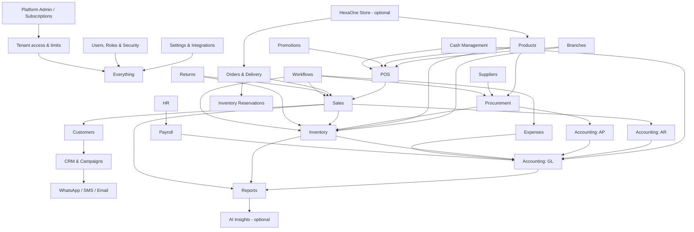

# HexaOne ERP — Feature Gap Analysis & Master Scope

**Baseline:** `docs/general-erp-features.md` (General Shop edition), verified against the current codebase (`apps/api` Prisma schema + modules, `apps/web` pages, `apps/desktop`).
**Purpose:** master reference for product development, UI/UX, database design, API development and future SRS/BRD work.
**Date:** Sep 2026

### How to read this document

| Tag | Meaning |
|---|---|
| ✅ **Implemented** | Exists in code and is usable from the UI |
| 🟡 **Partial** | Exists but is shallow, API-only, vertical-only, or missing key states |
| ❌ **Missing** | Not present in schema or code |
| **[REC]** | A recommendation, not an existing feature or a confirmed business rule |

| Priority | Meaning |
|---|---|
| **P0 – Critical** | Blocks production readiness, data integrity, money correctness or security |
| **P1 – Important** | Expected by medium and multi-branch businesses; needed to be competitive |
| **P2 – Optional** | Adds value for some customers; can be a plan add-on |
| **P3 – Future / Advanced** | Strategic or AI features, built after the core is stable |

> Existing terminology is kept: *Sales, Quotations, Returns, Procurement, GRN, Purchase Returns, Procurement Hub, Cash Management, Workflows, Branches, Users & Roles, Reports & Analytics, HR & Payroll, Platform Admin*.

---

## Contents

1. [Current Feature Coverage](#1-current-feature-coverage)
2. [Module-by-Module Review](#2-module-by-module-review)
3. [Missing Features by Module (with Priority)](#3-missing-features-by-module-with-priority)
4. [Recommended New Modules](#4-recommended-new-modules)
5. [Critical vs Optional Summary](#5-critical-vs-optional-summary)
6. [Module Dependency Map](#6-module-dependency-map)
7. [Recommended Navigation Structure](#7-recommended-navigation-structure)
8. [Business Workflow Map](#8-business-workflow-map)
9. [Edge Cases & Business Rules](#9-edge-cases--business-rules)
10. [UX / UI Review](#10-ux--ui-review)
11. [Data / Entity Requirements](#11-data--entity-requirements)
12. [Permission Requirements](#12-permission-requirements)
13. [Security, Administration & SaaS](#13-security-administration--saas)
14. [Reporting & BI Requirements](#14-reporting--bi-requirements)
15. [AI / Smart ERP (Optional Layer)](#15-ai--smart-erp-optional-layer)
16. [Final HexaOne ERP Scope](#16-final-hexaone-erp-scope)
17. [Suggested Delivery Roadmap](#17-suggested-delivery-roadmap)

---

## 1. Current Feature Coverage

A strong base already exists. **About 70% of a full retail ERP is in place.** The gaps are mostly *operational depth* (orders, delivery, stock counting UI, voids), *SaaS billing*, *offline resilience* and *administration tooling*, not core modules.

| Module | Status | Evidence (key models / pages) |
|---|---|---|
| POS terminal | ✅ | `Sale`, `SaleItem`, `SalePayment`, `HeldBill`, `PosCounter`, `CashRegister`; 6 layouts; customer display |
| Sales list / detail | ✅ | `/sales` |
| Quotations | ✅ | `Quotation`, `QuotationItem`, approval workflow |
| Returns & Exchanges | ✅ | `Return`, `ReturnItem`, `ReturnStatus` |
| Customers / Loyalty / Wallet / Credit | ✅ | `Customer`, `LoyaltyTransaction`, `WalletTransaction`, `CustomerCredit*` (schedules, reminders) |
| Products / Variants / Brands / Categories | ✅ | `Product`, `ProductVariant`, `Brand`, `Category`, `BarcodeMode` |
| Inventory stock & ledger | ✅ | `Inventory`, `InventoryLog`, `StockMovementType` |
| Lots / Expiry (Grocery-type shops) | ✅ | `InventoryLot`, `InventoryLotReservation`, FEFO/FIFO strategy |
| Stock count sessions | 🟡 | `StockCountSession`, `StockCountLine` exist; **no UI** |
| Stock reservations | 🟡 | `InventoryReservation`; no reservation source other than internal |
| Warehouses | ✅ | `Warehouse`, warehouse transfers |
| Stock transfers | ✅ | `StockTransfer`, `StockTransferItem`, `StockTransferLot`, 2-step approval |
| Suppliers / PO / GRN / Purchase Returns | ✅ | `PurchaseOrder`, `GoodsReceipt`, `SupplierReturn`, `SupplierInvoice`, `SupplierPayment(Allocation)`, `SupplierLedgerEntry`, `SupplierDebitNote` |
| Purchase Requests | ✅ | `PurchaseRequest(Item)` |
| Accounting (GL, COA, periods, VAT, assets, petty cash, budgets, cost centres, FX, recurring) | ✅ | `Account`, `JournalEntry`, `FiscalYear`, `AccountingPeriod`, `VatReturn`, `FixedAsset*`, `PettyCash*`, `AccountingBudget`, `CostCenter`, `ExchangeRate`, `RecurringJournal`, `AccountingOutboxEvent` |
| Cash & Bank, Cheques, Reconciliation | ✅ | `BankAccount`, `BankTransaction`, `BankReconciliation`, `Cheque`, `CashBookEntry` |
| Cash Management (shifts, counters, variance) | ✅ | `Shift`, `CashRegister`, `CashMovement` |
| Expenses & Expense Claims | ✅ | `Expense`, `ExpenseClaim`, `Reimbursement` |
| HR & Payroll | ✅ | `Employee`, `Attendance`, `LeaveRequest`, `Hr*` masters, `PayrollRun`, `Payslip` |
| Workflows / Approvals | ✅ | `WorkflowDefinition/Step/Instance/Task/Event` |
| Promotions / Gift Vouchers | ✅ | `Promotion`, `PromotionProduct`, `GiftVoucher` |
| Notifications | ✅ | `Notification`, `UserNotification`, scheduled scans |
| WhatsApp | ✅ | QR-linked session, bill send, credit reminders |
| Security | 🟡 | 2FA, login lockout (`loginAttempts`, `lockedUntil`), `Session`, `AuditLog`; no session/device UI, no IP rules, no API keys |
| Platform Admin / SaaS | 🟡 | `Tenant.plan/status/trialEndsAt/max*`, announcements, releases, SSL; **no Subscription/Invoice tables**, only Starter trial auto-suspend |
| Desktop App | ✅ | Electron, auto-update, customer display window |
| Document numbering | ✅ | `DocumentNumberSeries` |
| Calendar | ✅ | `CalendarNote/Task/Meeting` |
| Receipt print logging | ✅ | `ReceiptPrintLog` |

---

## 2. Module-by-Module Review

For each module: **what exists**, **gaps**, **duplication**, **dependencies**.

### 2.1 POS
- **Exists:** scanning, variants, weighed items, multi-price picker, held bills, split payments, 10 payment methods, Quick GRN, Quick Expense, shift gate, PIN lock, receipts, WhatsApp bill, customer display.
- **Gaps:**
  - No **offline mode**
  - No **idempotency key** on sale submit, so a double click or retry can create duplicate sales
  - No **sale void** (only returns)
  - No **cash drawer kick** command
  - No **weighing-scale integration** (weight is typed in)
  - No **hardware diagnostics** page
- **Duplication:** POS "Returns", "Quick GRN" and "Quick Expense" duplicate full pages. This is **intentional** (fast path) and should stay, but they must call the *same* services (they do).
- **Depends on:** Products, Inventory, Customers, Promotions, Cash Management, Accounting (posting), Settings.

### 2.2 Sales / Quotations / Returns
- **Exists:** sales list, quotations with approval to POS, returns with exchange.
- **Gaps:**
  - No **Sales Order** entity (Quotation → Sale jumps straight to a paid POS sale)
  - No delivery, partial delivery or back orders
  - No **invoice void / cancellation** endpoint (`SaleStatus.CANCELLED` exists but no controlled flow)
  - No invoice correction / credit note document separate from returns
  - No salesperson **targets**
- **Should become a sub-module:** *Orders & Delivery* under Sales (see §4).
- **Depends on:** POS/Sale, Inventory (reservation), Customers (credit), Accounting.

### 2.3 Customers / CRM
- **Exists:** tiers, loyalty, wallet, credit limit, instalment schedules, reminders, segments (basic).
- **Gaps:**
  - No **customer groups** (price lists / discount groups)
  - No interaction history, follow-up tasks or customer notes timeline
  - No campaigns (birthday / special day)
  - No communication log across WhatsApp / SMS / email
  - No SMS gateway (the SMS channel only queues messages)
  - No churn or retention analytics
- **Depends on:** Sales, WhatsApp, Notifications.

### 2.4 Products / Catalog
- **Exists:** variants matrix, barcode modes, images, CSV import, labels, branch availability, supplier assignment.
- **Gaps:**
  - No **branch-specific price** (a single `sellingPrice` per variant; POS multi-price comes from PO history only)
  - No price lists / customer group pricing
  - No **serial-number tracking** for general goods (only `TyreSerial` for tyres)
  - No UoM conversion (buy in box, sell in pcs)
  - Duplicate-barcode / duplicate-SKU validation should be surfaced in the UI (verify service rules)
- **Depends on:** Categories, Brands, Suppliers, Inventory.

### 2.5 Inventory / Warehouse
- **Exists:** stock, ledger, adjustments (with approval), lots / expiry (Grocery), transfers, ABC / dead / aging, warehouses, and now a **PO stock-balance popup** (Grocery).
- **Gaps:**
  - **Stock count UI** (sessions exist in the DB)
  - Variance approval for counts
  - **Inventory valuation method** (costing uses cost price / lot `unitCost`; no formal FIFO/WAC selection or valuation report per method)
  - Quarantine stock status
  - Movement **reason master** (reasons are free text / fixed enum)
  - Inventory period closing
  - Stock audit report
- **Duplication:** "Inventory → Stock Transfers" vs "Warehouse transfers": two transfer concepts (branch-level vs warehouse-level). **[REC]** Keep both but show them in one "Transfers" page with a *type* filter.
- **Depends on:** Products, Procurement, Sales, Accounting (valuation / COGS).

### 2.6 Procurement
- **Exists:** Purchase Requests, PO (free qty, expiry, selling, MRP, multi-line), GRN (From PO / Direct / Quick), purchase returns, supplier invoices, payments with allocation, ledger, debit notes, price history, performance.
- **Gaps:**
  - No **supplier quotations** (RFQ) and comparison
  - No purchase budget check
  - No **landed cost** (freight / duty apportionment)
  - No **3-way match** (PO ↔ GRN ↔ Supplier Invoice) enforcement
  - No lead-time analysis report
  - Reorder automation is suggestion-only (no auto-draft PO)
  - Supplier credit-limit enforcement is not guaranteed
- **Depends on:** Suppliers, Products, Inventory, Accounting, Workflows.

### 2.7 Finance & Accounting
- **Exists:** very complete: GL, auto-posting outbox, financial statements, AR/AP, bank reconciliation, cheques, VAT, petty cash, assets, budgets, cost centres, FX, recurring journals, period close.
- **Gaps:**
  - No **daily financial closing** (day-end lock across POS + cash + bank)
  - No payment-gateway reconciliation (no gateway yet)
  - No customer receipt allocation UI across multiple invoices (supplier side exists)
  - No collection follow-up workbench
  - No inter-branch settlement
  - Branch-level budgets (`CostCenter` can be used; see §3)
- **Duplication:** "Accounting → Payroll" and "HR → Payroll" are two payroll entry points (`PayrollRun` vs `Payroll`). **[REC]** Merge into a single payroll engine owned by HR with GL posting to Accounting; keep one menu entry.
- **Duplication:** "Finance Hub" (`/accounting/finance`, hidden) overlaps with AR/AP + Cash & Bank + Cheques. **[REC]** Retire it or make it the landing page of Accounting, not a third path.

### 2.8 Cash Management & Expenses
- **Exists:** open / close with denominations, cash in / out, safe ↔ register, variance approval, expenses with charts.
- **Gaps:** expense **approval** for large amounts (claims have it; direct expenses do not), recurring expenses, attachment (receipt image) on expenses.

### 2.9 Reports & Analytics
- **Exists:** ~13 report pages + Analytics (P&L trend, best sellers, profit by product, cashier, branches).
- **Gaps:**
  - Consistent **branch / warehouse filters** on every report
  - **Excel / PDF export** everywhere (print exists; export varies)
  - Void / discount / return reports
  - Stock valuation / variance reports
  - Purchase price variance, AR/AP aging in the Reports hub, budget vs actual, forecasts
  - **Scheduled report emails**

### 2.10 HR & Payroll
- **Exists:** employees, masters, attendance, leaves, payroll (EPF / ETF).
- **Gaps:** employee ↔ user link for cashier performance / commission, overtime rules, loans / advances, leave balance accrual, attendance device import. (P2, since HR is secondary for retail.)

### 2.11 Branches / Users & Roles
- **Exists:** branches, switcher, custom roles, permission matrix, branch-scoped products.
- **Gaps:**
  - **Head Office** role / console
  - A user assigned to **multiple branches** with different roles (verify `UserRole` scope)
  - Branch pricing / promotions
  - Branch targets and budgets
  - Branch profitability dashboard

### 2.12 Workflows
- **Exists:** generic engine with seven or more approval types.
- **Gaps:** approval for **sale void**, **refund above limit**, **credit limit override**, **price override below cost**, **expense above limit**, **supplier payment above limit**; SLA / escalation; approvals from mobile.

### 2.13 Promotions
- **Exists:** %, fixed, Buy X Get Y, coupons, limits, dates, gift vouchers.
- **Gaps:** branch scope, customer-group scope, happy-hour (time-of-day), bundle price, promotion stacking rules (explicit priority).

### 2.14 WhatsApp / Notifications
- **Exists:** QR session, bill, reminders; in-app + email alerts.
- **Gaps:** SMS provider, template management, delivery log, opt-out handling, campaign sending with rate limits.

### 2.15 Settings / Security / Desktop
- **Exists:** rich settings, 2FA, lockout, audit, auto-update desktop.
- **Gaps:**
  - Active sessions / device list with **force logout** (the `Session` model exists; no UI)
  - Password policy config
  - IP allow-list
  - API keys / webhooks
  - Tenant self-service **data export** and **backup / restore**
  - Desktop **offline cache** and **local print queue**

### 2.16 Platform Admin / SaaS
- **Exists:**
  - Tenants, plans (`SubscriptionPlan` enum), limits on `Tenant` (`maxBranches`, `maxUsers`, `maxProducts`)
  - Status (`TRIAL / ACTIVE / SUSPENDED / CANCELLED`)
  - Starter-trial auto-suspend (daily cron + request guard)
  - Staff roles (SUPER_ADMIN / PLATFORM_STAFF), announcements, releases, SSL, impersonation
- **Gaps:**
  - No `Subscription`, `SubscriptionInvoice` or `SubscriptionPayment` tables
  - No renewal / expiry for paid plans
  - No grace period
  - No **feature flags per plan**
  - No storage limit
  - No coupons
  - No automated dunning
  - No SaaS revenue dashboard from real invoices (MRR is derived)

---

## 3. Missing Features by Module (with Priority)

### A. Sales & Order Management

| Feature | Status | Priority | Notes |
|---|---|---|---|
| Invoice void / cancel (same day, before close) | ❌ | **P0** | Reverse stock, payments, loyalty, GL; needs approval + reason |
| Duplicate sale prevention (idempotency key) | ❌ | **P0** | Client-generated `clientRequestId` unique per tenant |
| Invoice correction via credit note | 🟡 | P1 | Today only via Return; add a *Credit Note* document type |
| Sales Orders (Quotation → Order → Invoice) | ❌ | P1 | For wholesale / bulk customers |
| Stock reservation from order | 🟡 | P1 | Reuse `InventoryReservation` |
| Partial delivery / back orders | ❌ | P1 | Delivery Note lines vs order lines |
| Delivery management & status tracking | ❌ | P1 | Pending → Packed → Dispatched → Delivered / Failed |
| Order cancellation | ❌ | P1 | Releases reservation |
| Pending orders / fulfilment dashboard | ❌ | P1 | |
| Customer order history (orders + sales) | 🟡 | P1 | Sales history exists; add orders tab |
| Salesperson commission | 🟡 | P1 | Helper commission exists at POS; add to Orders + Employee link |
| Salesperson targets | ❌ | P2 | Monthly target vs actual |

### B. Inventory

| Feature | Status | Priority | Notes |
|---|---|---|---|
| Physical stock take UI (count sessions) | 🟡 API only | **P0** | Freeze snapshot, count, variance, approve, post `STOCK_COUNT` |
| Stock variance approval | 🟡 | **P0** | Via Workflows |
| PO-page stock balance (Grocery) | ✅ new | — | Adjustment + approval |
| Inventory valuation report | 🟡 | **P0** | Stock value by branch / warehouse at cost |
| Costing method (FIFO via lots / Weighted Average) | 🟡 | P1 | **[REC]** WAC default for General; FIFO for lot-tracked shops |
| Movement reason master | ❌ | P1 | Tenant-configurable reasons mapped to `StockMovementType` |
| Batch / Lot tracking for any shop | 🟡 vertical | P1 | Allow enabling per product, not only per shop type |
| Serial number tracking (general) | ❌ | P1 | Generalise `TyreSerial` → `SerialNumber` |
| Damaged stock bucket | ✅ | — | `damagedQty` |
| Expired stock handling | 🟡 | P1 | Expiry write-off job + report for lot shops |
| Quarantine stock | ❌ | P2 | Status on lot / bucket; not sellable |
| Stock allocation (to orders / branches) | ❌ | P2 | Depends on Sales Orders |
| Inventory closing (period lock) | ❌ | P2 | Block backdated movements before close date |
| Stock audit (who changed what) | 🟡 | P1 | Ledger exists; add audit report with user / reason |
| UoM conversion (box ↔ pcs) | ❌ | P1 | Purchase UoM vs sales UoM |

### C. Procurement

| Feature | Status | Priority | Notes |
|---|---|---|---|
| Purchase Requests + approval | ✅ | — | |
| PO → GRN → Invoice → Payment | ✅ | — | |
| 3-way match (qty / price tolerance) | ❌ | P1 | Block or flag supplier invoice mismatches |
| Supplier credit-limit warning / block | 🟡 | P1 | Show on PO; block by setting |
| Reorder automation (auto-draft PO from min / max) | 🟡 | P1 | Suggestions exist |
| Min / max rules per branch | 🟡 | P1 | Fields exist on product; make branch-level |
| Lead-time analysis | 🟡 | P2 | `leadTimeDays` exists; add actual vs promised report |
| Supplier quotations (RFQ) + comparison | ❌ | P2 | |
| Purchase budget | ❌ | P2 | Via `AccountingBudget` by cost centre |
| Landed cost | ❌ | P2 | Apportion freight / duty to GRN lines → unit cost |
| Purchase return tracking to credit | ✅ | — | Debit notes |

### D. CRM

| Feature | Status | Priority | Notes |
|---|---|---|---|
| Customer notes & interaction timeline | ❌ | P1 | |
| Follow-up tasks / reminders | 🟡 | P1 | Reuse `CalendarTask` linked to customer |
| Customer groups (pricing / discount) | ❌ | P1 | |
| Communication history (WhatsApp / SMS / email) | ❌ | P1 | `MessageLog` |
| SMS gateway integration | 🟡 queue only | P1 | Pluggable provider (e.g. local SL gateways) |
| Birthday / special-day campaigns | ❌ | P2 | Needs `dateOfBirth` + opt-in |
| Marketing campaigns | ❌ | P2 | Segment → template → channel → schedule |
| Customer profitability | ❌ | P2 | Margin per customer |
| Retention / churn indicators | ❌ | P3 | Last purchase recency (RFM) |

### E. Finance & Reconciliation

| Feature | Status | Priority | Notes |
|---|---|---|---|
| Daily closing (Day End) | 🟡 | **P0** | Shift close exists; add branch day-end lock + summary |
| Financial period locking | ✅ | — | Periods close / reopen |
| Cash reconciliation | ✅ | — | Denominations + variance |
| Bank reconciliation | ✅ | — | |
| Customer payment allocation (multi-invoice) | 🟡 | P1 | Oldest-first exists for credit; add manual allocation UI |
| Supplier payment allocation | ✅ | — | |
| Receivable / payable aging | ✅ | — | Add to Reports hub |
| Collection follow-up workbench | 🟡 | P1 | Reminders exist; add worklist |
| Expense approval (direct expenses) | ❌ | P1 | Threshold-based |
| Budget vs actual | ✅ | — | Command Center |
| Payment gateway reconciliation | ❌ | P2 | Only after a gateway exists |
| Inter-branch settlement | ❌ | P2 | Due-to / due-from accounts on transfers |
| Profit allocation / fund management | ❌ | P3 | Not typical for SME retail; **[REC]** defer |

### F. Multi-Branch

| Feature | Status | Priority | Notes |
|---|---|---|---|
| Branch product availability | ✅ | — | |
| Branch comparison report | ✅ | — | |
| Branch-specific pricing | ❌ | P1 | `BranchPrice` override table |
| Branch-specific promotions | ❌ | P1 | `Promotion.branchIds` |
| Branch transfer requests | 🟡 | P1 | Transfers exist; add *request* by receiving branch |
| Head Office console / controls | ❌ | P1 | Consolidated dashboard, push prices / promos |
| Branch profitability / stock valuation | 🟡 | P1 | |
| Branch targets / budgets | ❌ | P2 | |
| Inter-branch settlement | ❌ | P2 | |

### G. Hardware & POS Resilience

| Feature | Status | Priority | Notes |
|---|---|---|---|
| Barcode / QR scanner (HID) | ✅ | — | |
| Thermal printer 58 / 80 mm, LAN print server | ✅ | — | |
| A4 invoice print | 🟡 | P1 | Quotation PDF exists; add A4 tax invoice template |
| Printer test | ✅ | — | |
| **Duplicate transaction prevention** | ❌ | **P0** | Idempotency key |
| **Network failure handling** (retry, clear error, no lost cart) | 🟡 | **P0** | Persist cart locally; safe retry |
| Receipt print queue / reprint on failure | 🟡 | P1 | `ReceiptPrintLog` exists; add retry queue |
| Cash drawer kick | ❌ | P1 | ESC/POS pulse via print server |
| Hardware diagnostics page | ❌ | P1 | Scanner, printer, drawer, display, scale checks |
| POS terminal registration / config | 🟡 | P1 | Counters exist; add device binding |
| Weighing-scale integration | ❌ | P2 | Serial / USB via desktop app; barcode-embedded weight (EAN-13 prefix 2x) is **P1** and cheaper |
| **Offline POS + sync** | ❌ | P2 → P1 for large clients | Desktop-only; local queue, conflict rules (see §9) |

### H. Online / E-Commerce (optional module)

| Feature | Status | Priority |
|---|---|---|
| Online catalog, cart, customer accounts | ❌ | P3 |
| Online payments (gateway: PayHere / card) | ❌ | P3 |
| Online order → Sales Order sync | ❌ | P3 (needs Sales Orders) |
| Online stock sync (available = on hand − reserved − safety stock) | ❌ | P3 |
| Delivery integration, online cancel / return | ❌ | P3 |

**[REC]** Build as a separate optional module (**HexaOne Store**), enabled by plan feature flag. It reuses Products, Sales Orders, Inventory Reservations and Customers. Physical-only shops never see it.

### I. Owner App (mobile / responsive)

| Feature | Status | Priority |
|---|---|---|
| Responsive owner dashboard (today sales, profit, expenses, dues, low stock, branches) | 🟡 (dashboard exists, desktop-first) | P1 |
| Approvals inbox on mobile | ❌ | P1 |
| Push notifications / daily summary on WhatsApp | 🟡 (email + in-app) | P1 |
| Native mobile app | ❌ | P3 |

**[REC]** Start with a **PWA "Owner" view** (`/owner`) instead of a native app.

### J. SaaS / Platform Admin

| Feature | Status | Priority |
|---|---|---|
| Tenants, status, impersonation, SSL, custom domain | ✅ | — |
| Plan limits: users / branches / products | ✅ (on `Tenant`) | — |
| Starter trial expiry → suspend | ✅ | — |
| **Subscription + invoice + payment records** | ❌ | **P0** |
| **Paid-plan renewal / expiry / grace period** | ❌ | **P0** |
| Suspension / reactivation flow with reason | 🟡 | **P0** |
| Feature flags per plan (module enable / disable) | ❌ | P1 |
| Usage metering dashboard (users, branches, products, storage) | 🟡 | P1 |
| Storage limit | ❌ | P1 |
| Custom plans / add-ons | 🟡 (`CUSTOM` enum) | P1 |
| Coupons / discounts on subscription | ❌ | P2 |
| SaaS revenue dashboard (MRR, churn, ARPU from invoices) | 🟡 | P1 |
| Tenant activity & health (last login, sales volume) | 🟡 | P1 |

---

## 4. Recommended New Modules

Only where existing modules cannot logically hold the functionality.

| New module / sub-module | Parent | Why it cannot live in existing modules |
|---|---|---|
| **Orders & Delivery** | Sales | A new document lifecycle (order → delivery → invoice) distinct from instant POS sales |
| **Stock Count** (UI over `StockCountSession`) | Inventory | Has its own session lifecycle and variance approval |
| **CRM Activities & Campaigns** | Customers | Needs timeline, tasks, templates, sending |
| **Subscriptions & Billing** | Platform Admin | Tenant-level money, independent of tenant accounting |
| **System Administration** (Import / Export Center, Jobs, Logs, Integrations, Backups) | Settings (tenant) + Platform Admin (global) | Cross-cutting tooling |
| **Integrations** (API keys, webhooks, SMS / email / WhatsApp providers, payment gateways) | Settings | Shared by CRM, POS, E-commerce |
| **Owner View** (PWA) | Dashboard | Different device and UX, same APIs |
| **HexaOne Store** (optional) | New | Online channel; must not affect physical-only tenants |

Not recommended as new modules (fits existing):
- Salesperson targets → *Reports + HR*
- Branch pricing → *Products*
- Landed cost → *Procurement / GRN*
- Day End → *Cash Management*
- Customer groups → *Customers*

---

## 5. Critical vs Optional Summary

### P0 — Critical (production readiness)
1. POS **idempotent sale submit** (duplicate prevention)
2. **Invoice void / cancel** with approval, full reversal (stock, payment, loyalty, wallet, GL)
3. **Network failure handling** at POS (no lost cart, safe retry, clear status)
4. **Stock Count UI** + variance approval + posting
5. **Inventory valuation report** (by branch / warehouse)
6. **Day End / daily closing** per branch
7. **SaaS Subscriptions & Billing**: subscription, invoice, payment, renewal, expiry, grace, suspension, reactivation (for *all* plans, not only Starter)
8. **Backup & restore** policy (automated DB backups, tested restore), plus a tenant data export
9. **Active sessions + force logout**, password policy
10. Consistent **branch filter + export (CSV / Excel / PDF)** on financial & stock reports

### P1 — Important
- Sales Orders, delivery, partial delivery, back orders, order cancellation
- Credit note document, salesperson commission on orders
- Branch pricing, branch promotions, Head Office console, transfer requests
- Serial tracking (general), lots per product, movement reason master, UoM conversion, costing method
- 3-way match, supplier credit-limit control, auto-draft reorder POs
- CRM notes / timeline / follow-ups, customer groups, communication log, SMS gateway
- Expense approval, customer receipt allocation, collections workbench
- A4 tax invoice, cash drawer, hardware diagnostics, print retry queue, embedded-weight barcodes
- Plan feature flags, usage & storage limits, SaaS revenue dashboard
- Owner PWA + mobile approvals
- Import / Export Center, background job monitor, integration logs, API keys & webhooks
- Approval types: void, refund limit, credit override, below-cost price, large expense / payment

### P2 — Optional
- Supplier RFQ & comparison, landed cost, purchase budget
- Quarantine stock, stock allocation, inventory closing
- Campaigns, birthday offers, customer profitability
- Branch targets / budgets, inter-branch settlement
- Weighing scale (serial), offline POS (desktop)
- Subscription coupons, salesperson targets
- HR: loans / advances, overtime, attendance device import

### P3 — Future / Advanced
- HexaOne Store (e-commerce), payment gateway reconciliation
- Native mobile app
- AI layer (§15)
- Profit allocation / fund management

---

## 6. Module Dependency Map



Rules:
- **Accounting never writes back** into operational modules; it consumes events (the existing `AccountingOutboxEvent` pattern). Keep this.
- **Workflows** are a service used by modules. Modules own their state; Workflows only approve or reject.
- **Optional modules** (Store, AI, Owner app) depend on the core, and the core never depends on them.

---

## 7. Recommended Navigation Structure

Items marked 🆕 are new. Everything else exists today. Items are shown or hidden by shop profile, plan feature flags and permissions.

```
Overview
  ├─ Dashboard
  ├─ Business Calendar
  ├─ Notifications
  └─ Approvals Inbox 🆕            (my pending Workflow tasks)

Sales
  ├─ POS (overlay)
  ├─ Sales (Invoices)
  ├─ Sales Orders 🆕
  ├─ Deliveries 🆕
  ├─ Quotations
  ├─ Returns & Credit Notes       (Credit Note 🆕)
  └─ Promotions & Vouchers        (moved from Reports)

Customers
  ├─ Customers
  ├─ Customer Groups 🆕
  ├─ Credit & Collections         (existing /accounting/credit)
  ├─ Loyalty & Wallet
  └─ Campaigns 🆕 (P2)

Catalog
  ├─ Products
  ├─ Categories
  ├─ Brands
  ├─ Price Lists / Branch Prices 🆕
  └─ Barcode & Labels

Inventory
  ├─ Stock Levels
  ├─ Inventory Ledger
  ├─ Stock Adjustments
  ├─ Stock Count 🆕
  ├─ Transfers                    (branch + warehouse, one page)
  ├─ Lots & Expiry                (when enabled)
  ├─ Serial Numbers 🆕            (when enabled)
  ├─ Warehouses
  └─ Stock Analysis               (ABC, Dead Stock, Aging, Valuation 🆕)

Procurement
  ├─ Procurement Hub
  ├─ Purchase Requests
  ├─ Supplier Quotations 🆕 (P2)
  ├─ Purchase Orders
  ├─ GRN
  ├─ Supplier Invoices
  ├─ Purchase Returns
  ├─ Supplier Payments
  └─ Suppliers

Finance
  ├─ Cash Management              (+ Day End 🆕)
  ├─ Expenses
  ├─ Accounting
  │    ├─ Overview / Command Center
  │    ├─ Chart of Accounts, GL Journals
  │    ├─ AR / AP, Cash & Bank, Cheques, Reconciliation
  │    ├─ VAT / Tax, Petty Cash, Fixed Assets
  │    ├─ Budgets & Cost Centres
  │    ├─ Periods & Year End
  │    └─ Settings & GL Mappings
  └─ Financial Reports

Reports & Analytics
  ├─ Reports Hub                  (Sales, Inventory, Purchasing, Finance, Management)
  ├─ Analytics
  ├─ Scheduled Reports 🆕
  └─ AI Insights 🆕 (optional)

HR & Payroll
  ├─ Employees, Departments, Designations
  ├─ Shifts, Attendance, Leaves, Holidays
  └─ Payroll                      (single engine; remove duplicate Accounting → Payroll)

Administration
  ├─ Branches
  ├─ Users & Roles
  ├─ Workflows (definitions)
  ├─ Sessions & Devices 🆕
  ├─ Import / Export Center 🆕
  ├─ Integrations 🆕              (WhatsApp, SMS, Email, Printers, API keys, Webhooks)
  ├─ Background Jobs & Logs 🆕
  ├─ Audit Log
  └─ Settings

Platform Admin (/admin, Hexalyte only)
  ├─ Dashboard (SaaS revenue 🆕)
  ├─ Tenants                      (status, usage 🆕, activity)
  ├─ Subscriptions 🆕 / Invoices 🆕 / Payments 🆕
  ├─ Plans & Feature Flags 🆕
  ├─ Coupons 🆕 (P2)
  ├─ Domains & SSL
  ├─ Announcements, Releases, Feature Suggestions, Support
  ├─ System Health, Jobs, Logs, Backups 🆕
  ├─ Security Scan
  └─ Admins (Super Admin only)
```

**Clean-ups [REC]:**
- Move **Promotions** out of *Reports* into *Sales*.
- Merge the two **Payroll** entry points.
- Hide or remove the internal **"Advanced / ERP Roadmap"** page from tenants.
- Retire the hidden **Finance Hub** duplicate.
- Show **Expiry report** only when expiry / batch is enabled (currently shown for General).

---

## 8. Business Workflow Map

Each workflow lists **states**, then **validations / approvals**, then **failure cases**. Items marked 🆕 are missing today.

### 8.1 POS Sale
```
Customer (optional) → Cart → Promotions/Discounts → Payment → Sale COMPLETED
   → Stock deduction (lot allocation) → Loyalty/Wallet/Credit update
   → Accounting outbox event → GL posting → Receipt (print/WhatsApp)
```
- **Validations:**
  - Stock available unless negative stock is allowed
  - Discount above limit needs approval
  - Credit sale ≤ credit limit (🆕 override approval)
  - Price below cost warning (🆕)
  - Open shift required
- **Failure cases:**
  - Network drop after submit: **🆕 idempotency key**, so a retry returns the same sale
  - Print failure: sale stays completed; 🆕 queue a reprint
  - GL posting failure: outbox retries (exists)
- **States:** `PENDING`, `COMPLETED`, `ON_HOLD`, `CANCELLED` (🆕 controlled void), `REFUNDED`, `PARTIALLY_REFUNDED`

### 8.2 Sales Order (🆕)
```
Quotation (optional) → Sales Order [DRAFT → CONFIRMED] → Reserve stock
  → Delivery Note [PICKING → PACKED → DISPATCHED → DELIVERED | FAILED]
  → Invoice (Sale) → Payment(s) → Closed
  Cancel before delivery → release reservation
```
- Partial delivery sets the order to `PARTIALLY_DELIVERED`; the remainder becomes a **back order**.
- Invoice on delivery, or on order (setting).

### 8.3 Purchasing
```
Purchase Request [DRAFT → PENDING → APPROVED/REJECTED]
 → PO [DRAFT → PENDING_APPROVAL → SENT → CONFIRMED]
 → GRN [DRAFT → POSTED] (partial → PARTIALLY_RECEIVED)
 → Supplier Invoice (🆕 3-way match) → Supplier Payment (allocation)
 → AP/GL posting → PO CLOSED
```
- **Validations:** supplier credit limit (🆕 enforce), 🆕 purchase budget, price variance vs last price (warn), GRN qty ≤ PO qty + tolerance (🆕 setting).
- **Failure cases:**
  - Over-receipt (block or approve)
  - Supplier invoice price ≠ PO (flag)
  - Cancelled PO with a posted GRN (block cancel)

### 8.4 Returns
```
Original Sale lookup → Return [INITIATED] → Approval (🆕 required above refund limit)
 → [APPROVED] → Stock back (sellable | damaged) → Refund (cash/card/wallet/credit note)
 → [COMPLETED / REFUND_PROCESSED] → GL reversal
```
- **Validations:**
  - Return qty ≤ sold − already returned
  - Refund ≤ amount paid for those lines **after proportional bill discount**
  - Return window (🆕 setting)
  - Loyalty points reversed (🆕 verify)
- **Failure cases:** refund method unavailable (e.g. card) → fall back to wallet / credit note.

### 8.5 Stock Transfer
```
🆕 Transfer Request (receiving branch) → Approval → Transfer [PENDING]
 → Dispatch [IN_TRANSIT] (stock out of source) → Receive [RECEIVED] (stock into destination)
 → 🆕 Discrepancy (short/damaged) → Adjustment + approval → 🆕 inter-branch settlement
```
- **Failure cases:** partial receive, lost in transit (write-off with approval), cancel after dispatch (return transfer).

### 8.6 Stock Count (🆕 UI)
```
Create session (scope: branch/warehouse/category) [DRAFT]
 → Freeze snapshot [IN_PROGRESS] → Count (scanner/mobile) → Variance review
 → Approval (threshold) → [POSTED] → STOCK_COUNT movements + GL inventory variance
```
- Sales during the count: **[REC]** compare against the snapshot plus movements recorded after it.

### 8.7 Customer Credit
```
Credit Sale (≤ limit or approved override) → Outstanding (AR)
 → Reminder (due / overdue, WhatsApp) → Payment → Allocation (oldest-first or 🆕 manual)
 → Overpayment → Wallet advance → Closed
```
- 🆕 Block new credit when overdue exceeds X days (setting). Instalment schedules exist.

### 8.8 Day End (🆕)
```
All shifts closed → Cash variance approved → Cheques/bank deposits recorded
 → Day summary (sales, payments by method, expenses, returns, voids)
 → Lock date for branch (no backdated POS/stock changes) → Email/WhatsApp owner summary
```

### 8.9 Subscription (🆕 for paid plans)
```
Trial [TRIAL] → Plan selected → Subscription [ACTIVE] → Invoice issued
 → Payment [PAID] → Renewal date → Invoice (T-7 days) → Paid? continue
 → Unpaid at expiry → [PAST_DUE] Grace period (e.g. 7 days, banner + read-only warnings)
 → Grace ends → [SUSPENDED] (login allowed for owner → billing page only; POS blocked)
 → Payment → [ACTIVE] (reactivation) | 90 days suspended → [CANCELLED] (data retained per policy, export offered)
```
**Automatic behavior on expiry [REC]:**

| Stage | Tenant experience |
|---|---|
| T-7 / T-3 / T-1 days | Email + WhatsApp + in-app banner reminders |
| Expiry day | Status → `PAST_DUE`; full access, red banner |
| Grace period | Full POS still allowed (do not stop a shop mid-day); admin banner; no new branches / users |
| After grace | `SUSPENDED`: owner can log in to the Billing page and data export only; staff logins blocked; active sessions get a clear message at next request (existing `enforceTenantSubscriptionActive` guard) |
| Payment received | Immediate `ACTIVE`; limits restored |
| Long-term unpaid | `CANCELLED` after retention period; data export window; then scheduled deletion (policy **to be confirmed by business**) |

---

## 9. Edge Cases & Business Rules

Expected behavior. Items marked **[REC]** are recommendations to confirm.

| # | Case | Expected behavior |
|---|---|---|
| 1 | Duplicate barcode | Allowed only in *shared barcode* mode; POS shows a picker (exists). In unique mode, block save with the conflicting product name |
| 2 | Duplicate SKU | Block per tenant; suggest the next SKU |
| 3 | Negative stock | Blocked unless the tenant setting "Allow negative stock" is on (exists). Show a warning at POS; the "Zero negatives" tool exists; the stock count corrects it |
| 4 | Concurrent POS sales on the last unit | Row lock (`FOR UPDATE`, exists). The second sale fails with "only X left" unless negative stock is allowed |
| 5 | Same product from different purchase batches / prices | Lots allocate by FEFO / FIFO (exists); POS price picker for multiple selling prices (exists); COGS from allocated lot cost **[REC]** |
| 6 | Partial payment | Allowed only with a customer selected; the remainder goes to AR within the credit limit |
| 7 | Overpayment | Cash: change returned. Credit payment: excess goes to wallet as an advance (exists) |
| 8 | Refund exceeding payment | Block. Max refund = paid amount for returned lines net of the proportional discount |
| 9 | Cancelled invoice | 🆕 Void only before day end and with approval; reverse stock, payments, loyalty, wallet, GL; keep the record with status `CANCELLED` and a reason; never delete |
| 10 | Return after discount | Refund the proportional net price (line discount + share of the bill discount) |
| 11 | Return after loyalty points awarded | Reverse the earned points proportionally; if already redeemed, deduct from the refund or allow a negative balance **[REC: deduct from refund]** |
| 12 | Customer credit limit exceeded | Block the credit sale; manager override through Workflows (🆕) |
| 13 | Supplier credit limit exceeded | Warn on the PO; block by setting (🆕) |
| 14 | Stock transfer failure (short / damaged on receive) | Receive the actual qty; the difference goes to a discrepancy adjustment with approval |
| 15 | Payment failure (card / QR declined) | Sale is not completed; the cart stays; the cashier changes the method. No stock movement until completion |
| 16 | Printer failure | Sale stays completed; `ReceiptPrintLog` records failed; 🆕 retry queue + reprint from Orders |
| 17 | Internet failure | Web: cart persists locally; submit is disabled with a clear "offline" state; retry with the same idempotency key. Desktop offline mode is P2 |
| 18 | Duplicate payment (double submit / retry) | 🆕 Idempotency key on sale + payment endpoints; unique constraint `(tenantId, clientRequestId)` |
| 19 | Subscription expires during an active session | Next API call returns 403 with a subscription code; the UI shows a blocking modal; POS in the middle of a bill: **[REC]** allow finishing the current bill during the grace period |
| 20 | Multi-branch permission conflict | Permissions are evaluated per (user, branch); the branch switcher lists only allowed branches; reports are limited to allowed branches; Head Office role sees all |
| 21 | Backdated entries after period close | Blocked by period lock (exists for GL); 🆕 also for stock / POS after day end |
| 22 | Price change while items are in held bills | Held bill keeps its original price **[REC]**; show a "price changed" badge on restore |
| 23 | Product deleted with stock or history | Soft-deactivate only; block hard delete |
| 24 | Weighed item with decimal stock | Stock supports decimals for weighted units (verify integer-only DTOs such as transfers `@IsInt` and lot adjust) |
| 25 | Gift voucher partially used, then sale returned | Refund back to the voucher balance, not cash **[REC]** |

---

## 10. UX / UI Review

### Missing pages / dashboards
- Stock Count
- Approvals Inbox
- Sessions & Devices
- Import / Export Center
- Integrations
- Day End
- Sales Orders / Deliveries
- Owner View
- SaaS Billing (tenant side: plan, invoices, pay)
- Hardware Diagnostics

### Navigation issues
- Promotions sits under Reports; move it to Sales.
- Two payroll menus.
- Hidden Finance Hub duplicate.
- Transfers exist in both Inventory and Warehouse.
- Expiry report visible for General.
- "ERP Roadmap" page visible to tenants.

### Quick actions (global "+" menu) [REC]
- New Sale (POS)
- New Product
- New PO
- Quick GRN
- New Expense
- Receive Payment
- Stock Adjustment
- New Customer

### Filters (standard on every list) [REC]
- Date range, branch, warehouse, status, created by, search
- Saved filter presets

### Bulk actions [REC]
- Products: price update (%, fixed), category / brand change, activate / deactivate, print labels
- Customers: add to group, send message
- POs: approve
- Expenses: approve
- Notifications: mark read

### POS usability
- Keep the existing shortcuts (F1–F12)
- 🆕 Offline / online indicator
- 🆕 Printer and drawer status chips
- 🆕 Void last sale (with PIN)
- 🆕 Embedded-weight barcode support

### States (apply consistently)
- **Empty states** with a primary action ("No products yet → Import CSV / Add product")
- **Skeleton loaders** on tables and KPIs
- **Error states** with a retry and a human message (no raw API errors)
- **Confirmation dialogs** for destructive or money actions (void, delete, write-off, payment)
- **Success toasts** with the document number and a link ("PO-00123 created · View")

### Mobile responsiveness
- Owner-critical pages (dashboard, approvals, sales summary, low stock) must be fully usable on phones
- Data-entry-heavy pages (PO lines) keep card layouts (already done on the PO page)

### Simplicity principle
- **[REC]** "Simple / Advanced" view toggle per user: Simple hides Accounting internals, cost centres, FX and workflows definitions from normal shop users; admins see everything

---

## 11. Data / Entity Requirements

New or changed entities for the missing functionality (names follow existing Prisma conventions).

### Sales & Orders
| Entity | Key fields |
|---|---|
| `SalesOrder` | id, tenantId, branchId, orderNo, customerId, status (DRAFT, CONFIRMED, PARTIALLY_DELIVERED, DELIVERED, INVOICED, CANCELLED), expectedDate, totals, salespersonId |
| `SalesOrderItem` | orderId, variantId, qty, deliveredQty, invoicedQty, unitPrice, discount, reservationId |
| `DeliveryNote` / `DeliveryNoteItem` | orderId, status (PICKING, PACKED, DISPATCHED, DELIVERED, FAILED), driver / courier, trackingNo, deliveredAt, proof |
| `CreditNote` | saleId / returnId, amount, reason, status, applied to (wallet / cash / invoice) |
| `SaleVoid` (or fields on `Sale`) | voidedAt, voidedById, voidReason, approvalInstanceId |
| `Sale.clientRequestId` | unique (tenantId, clientRequestId), for idempotency |
| `SalesTarget` | employeeId / branchId, period, targetAmount |

### Inventory
| Entity | Key fields |
|---|---|
| `StockCountSession` / `StockCountLine` (exist) | + snapshotQty, countedQty, variance, approvalInstanceId |
| `StockMovementReason` | tenantId, code, label, movementType, requiresApproval |
| `SerialNumber` (generalise `TyreSerial`) | variantId, serialNo, status (IN_STOCK, SOLD, RETURNED, DAMAGED), grnItemId, saleItemId |
| `UnitConversion` | variantId, purchaseUom, salesUom, factor |
| `BranchPrice` / `PriceList` / `PriceListItem` | branchId or customerGroupId, variantId, price, validFrom / To |
| `InventoryClosing` | branchId, closedUntil, closedById |
| Tenant setting `costingMethod` | FIFO or WEIGHTED_AVERAGE |

### Procurement
| Entity | Key fields |
|---|---|
| `SupplierQuotation` / `SupplierQuotationItem` | requestId, supplierId, price, leadTime, validUntil, selected |
| `LandedCost` / `LandedCostLine` | grnId, type (freight, duty, other), amount, allocation basis |
| `InvoiceMatchResult` | supplierInvoiceId, poId, grnId, qtyVariance, priceVariance, status |

### CRM
| Entity | Key fields |
|---|---|
| `CustomerGroup` | name, priceListId, discountPct |
| `CustomerNote` / `CustomerActivity` | customerId, type (call, visit, note, WhatsApp, SMS, email), body, userId |
| `MessageLog` | channel, to, templateId, status (QUEUED, SENT, DELIVERED, FAILED), relatedType / Id |
| `MessageTemplate` | channel, name, body, variables |
| `Campaign` / `CampaignRecipient` | segment / group, template, schedule, status, stats |
| `Customer.dateOfBirth`, `marketingOptIn` | |

### Finance
| Entity | Key fields |
|---|---|
| `DayEnd` | branchId, businessDate, status (OPEN, CLOSED), totals JSON, closedById |
| `CustomerPaymentAllocation` | paymentId, saleId, amount |
| `InterBranchSettlement` | fromBranchId, toBranchId, transferId, amount, status |

### Platform / SaaS
| Entity | Key fields |
|---|---|
| `Plan` (replace enum-only) | code, name, price, interval, limits JSON (users, branches, products, storageMb), features JSON |
| `PlanFeature` / `TenantFeatureOverride` | featureKey, enabled |
| `Subscription` | tenantId, planId, status (TRIALING, ACTIVE, PAST_DUE, SUSPENDED, CANCELLED), currentPeriodStart / End, graceEndsAt, cancelAt |
| `SubscriptionInvoice` | subscriptionId, number, amount, discount, tax, status (DRAFT, OPEN, PAID, VOID, OVERDUE), dueDate |
| `SubscriptionPayment` | invoiceId, method, reference, amount, paidAt |
| `Coupon` / `CouponRedemption` | code, type, value, validity, maxUses |
| `TenantUsageSnapshot` | tenantId, date, users, branches, products, storageBytes, salesCount |
| `TenantDomain` | tenantId, domain, sslStatus, verifiedAt |

### Admin / Security / Integrations
| Entity | Key fields |
|---|---|
| `Session` (exists) | + UI for list / revoke |
| `TrustedDevice` | userId, deviceName, fingerprint, lastSeen |
| `PasswordPolicy` (tenant setting) | minLength, complexity, expiryDays, reuseCount |
| `IpAllowRule` | tenantId, cidr, scope |
| `ApiKey` | tenantId, name, hashedKey, scopes, lastUsedAt, revokedAt |
| `Webhook` / `WebhookDelivery` | url, events, secret, status, attempts, lastResponse |
| `ImportJob` / `ExportJob` | type, file, status, rows ok / failed, errorFile |
| `BackgroundJobRun` | job, startedAt, finishedAt, status, error |
| `BackupRecord` | scope (platform / tenant), location, size, status, restoredAt |

---

## 12. Permission Requirements

### Roles
**Existing:** Super Admin, Platform Staff, Tenant Admin, Branch Manager, Cashier, plus custom roles.

Recommended additional system role templates (built on the existing permission matrix):

| Role | Scope |
|---|---|
| **Owner** | Everything in the tenant, including billing and subscription |
| **Head Office Manager** 🆕 | All branches: pricing, promotions, transfers, reports; no billing |
| **Branch Manager** | Own branch: approvals, stock, cash, reports |
| **Cashier** | POS only |
| **Senior Cashier / Supervisor** 🆕 | POS + void / refund approval with PIN, cash close |
| **Storekeeper** 🆕 | Inventory, GRN, transfers, stock count; no costs if restricted |
| **Purchasing Officer** 🆕 | Purchase requests, POs, suppliers; no payments |
| **Accountant** 🆕 | Accounting, AR / AP, payments, bank, reports; no POS |
| **HR Officer** 🆕 | HR & payroll |
| **Sales Rep** 🆕 | Quotations, sales orders, own customers |
| **Viewer / Auditor** 🆕 | Read-only all, including audit log |

### Permission areas (resource : action)
Actions: `read, create, update, delete, approve, export, void, override`

- `pos` — sell, discount, discount:override, void, refund, reprint, open_drawer, price:override
- `sales`, `sales_orders`, `deliveries`, `quotations`, `returns`, `credit_notes`
- `customers`, `customer_credit` (override limit), `crm`, `campaigns`
- `products`, `pricing` (branch price, price lists), `cost:view` (hide cost & margin)
- `inventory`, `stock_adjust`, `stock_count`, `transfers`, `warehouses`, `lots`, `serials`
- `procurement` (pr, po, grn, supplier_invoice, supplier_payment, purchase_return), `suppliers`
- `cash` (open, close, variance:approve, day_end), `expenses` (approve)
- `accounting` (journals:post, periods:close, bank, cheques, vat, assets, budgets)
- `reports` (per group: sales, inventory, purchasing, finance, management), `reports:export`
- `hr`, `payroll`
- `branches`, `users`, `roles`, `workflows`, `settings`, `integrations`, `api_keys`, `audit`, `data_export`, `billing`
- **Platform:** `platform:tenants`, `platform:billing` (Super Admin), `platform:admins` (Super Admin), `platform:support`, `platform:system`

**Rules:**
- Every permission is evaluated **per branch** (user ↔ branch ↔ role).
- `cost:view` is separate, so cashiers and storekeepers can be hidden from margins.
- Money reversal actions (`void`, `refund`, `override`) always write an audit log entry with a reason.

---

## 13. Security, Administration & SaaS

### Security controls

| Control | Status | Priority |
|---|---|---|
| 2FA | ✅ | — |
| Login attempt lockout | ✅ | — |
| Audit logs | ✅ | — |
| Tenant isolation (tenantId scoping) | ✅ | Keep; **[REC]** add automated tests per module |
| Active sessions / devices UI, force logout | 🟡 (model exists) | **P0** |
| Password policy | ❌ | **P0** |
| Security alerts (new device, many failed logins, off-hours void) | 🟡 | P1 |
| IP restrictions | ❌ | P2 |
| API key management | ❌ | P1 (with integrations) |
| Webhook management | ❌ | P1 |
| Tenant data export (full JSON / CSV zip) | ❌ | **P0** |
| Backup management (automated, encrypted, offsite) | 🟡 ops-level | **P0** |
| Restore (tenant-level point-in-time from backup) | ❌ | P1 |

### System Administration

| Area | Tenant (Settings → Administration) | Platform Admin |
|---|---|---|
| Import Center (products, customers, suppliers, opening stock, opening balances) | 🟡 CSV import for products only; **P1** | — |
| Export Center | **P1** | — |
| Data migration (from other POS) | Templates + validation report **P1** | Assisted migration |
| Background jobs / scheduled tasks | View only | Full monitor (cron runs, failures) **P1** |
| System / error / integration logs | Integration logs | All logs **P1** |
| API / webhook monitoring | Deliveries per webhook | Global **P2** |
| Email / WhatsApp / SMS configuration | ✅ WhatsApp; Email / SMS **P1** | Default providers |
| Printer configuration & test | ✅ | — |
| System health / DB health / storage usage | Storage usage **P1** | ✅ health; DB + storage per tenant **P1** |

### SaaS layer (summary)
- Super Admin → **Tenants** → **Subscriptions** (plan, period, status, grace) → **Invoices** → **Payments**
- **Plans** = limits + **feature flags**; **Custom plans** = a per-tenant override
- **Usage limits** are enforced at create time: user, branch, product, storage (return a clear "upgrade" message)
- **Domains:** subdomain + custom domain + SSL status (exists) → move to the `TenantDomain` table
- **SaaS revenue dashboard:** MRR, ARR, new / churned tenants, ARPU, overdue invoices, trial conversion
- **Expiry automation:** see §8.9

---

## 14. Reporting & BI Requirements

**Standard for all reports [REC]:** date range, branch (multi-select), warehouse where relevant, export to CSV / Excel / PDF, print, saved filters, schedule by email.

| Group | Report | Status |
|---|---|---|
| **Sales** | Daily / monthly sales | ✅ |
| | Product / category / brand sales | 🟡 (product ✅; brand 🆕) |
| | Customer sales | ✅ |
| | Cashier sales | ✅ |
| | Payment method sales | 🟡 |
| | Discount report | ❌ P1 |
| | Return report | 🟡 P1 |
| | Void / cancellation report | ❌ P0 (with void feature) |
| | Hourly sales heatmap | ❌ P2 |
| **Inventory** | Stock valuation (by branch / warehouse / category) | 🟡 P0 |
| | Stock movement | ✅ |
| | Stock aging / dead stock | ✅ |
| | Fast / slow-moving | 🟡 (ABC) P1 |
| | Batch expiry | ✅ (lot shops) |
| | Serial tracking | ❌ P1 |
| | Stock variance (count) | ❌ P0 |
| | Stock adjustment report | 🟡 P1 |
| **Purchasing** | Supplier purchase report | ✅ |
| | Purchase price variance | 🟡 (price history) P1 |
| | Supplier performance | ✅ |
| | Outstanding purchases / open POs | 🟡 P1 |
| | Purchase returns | 🟡 P1 |
| **Finance** | P&L, Balance Sheet, Cash Flow, Trial Balance | ✅ |
| | AR aging / AP aging | ✅ (move into Reports hub) |
| | Expense analysis | ✅ |
| | Budget vs actual | ✅ |
| | Cash flow forecast | ❌ P2 |
| | Day End summary | ❌ P0 |
| **Management** | Branch comparison | ✅ |
| | Product profitability | ✅ |
| | Customer profitability | ❌ P2 |
| | Employee / cashier performance | ✅ (cashier) |
| | Business KPI scorecard | 🟡 P1 |
| | Sales / inventory forecast | ❌ P3 (AI) |

---

## 15. AI / Smart ERP (Optional Layer)

Kept **separate from the core** and switched on by plan feature flag (the existing "ShopAI™" brand fits). The core ERP must work fully without it.

| Feature | Approach (practical) | Priority |
|---|---|---|
| Reorder recommendations | Rule-based: avg daily sales × lead time + safety stock vs on hand. **Not AI; move to core P1** | P1 (core) |
| Slow-moving / dead-stock suggestions | Rules on aging + velocity, with actions (discount, return to supplier, transfer to a branch that sells it) | P1 (core) |
| AI business summary | LLM summarising daily KPIs, sent by WhatsApp / email | P2 |
| Anomaly detection | Statistical thresholds: void / refund spikes per cashier, cash variance, negative margin sales | P2 |
| Customer segmentation (RFM) | Scoring job; feeds CRM groups and campaigns | P2 |
| Churn indicators | Recency vs usual purchase interval | P3 |
| Sales / demand forecasting | Seasonal time-series per product / branch | P3 |
| Profit optimisation insights | Margin vs velocity matrix, price suggestions | P3 |
| Natural-language report queries | LLM translating to predefined, safe report APIs (never raw SQL), tenant-scoped | P3 |

**Guardrails [REC]:** AI outputs are *suggestions only*; they never auto-post transactions. All prompts and data are tenant-scoped, and every suggestion is explainable (it shows the numbers it used).

---

## 16. Final HexaOne ERP Scope

Consolidated scope = existing features (✅) + recommended additions (🆕, with priority).

### Core Platform
- Multi-tenant SaaS, shop-type profiles (General, Grocery, Clothing, Tyre, …), plans & limits ✅
- 🆕 P0 Subscriptions, invoices, payments, renewal, grace, suspension, reactivation
- 🆕 P1 Plan feature flags, usage and storage metering, SaaS revenue dashboard
- 🆕 P2 Coupons

### Sales
- POS (6 layouts, scan, weighed, multi-price, holds, 10 payment methods, Quick GRN / Expense, shifts, receipts, customer display, WhatsApp bill) ✅
- Sales, Quotations, Returns & Exchanges ✅
- 🆕 P0 Invoice void with approval; idempotent sale submit; network-failure-safe cart
- 🆕 P1 Sales Orders, Deliveries (partial / back orders), Credit Notes, A4 tax invoice, cash drawer, hardware diagnostics, embedded-weight barcodes
- 🆕 P2 Offline POS (desktop), weighing scale, salesperson targets

### Customers
- Tiers, loyalty, wallet, credit, instalments, reminders ✅
- 🆕 P1 Customer groups, notes / timeline, follow-ups, communication log, SMS gateway
- 🆕 P2 Campaigns, birthday offers, customer profitability
- 🆕 P3 Churn analytics

### Catalog
- Products, variants, barcodes, images, CSV import, labels, branch availability ✅
- 🆕 P1 Branch prices / price lists, UoM conversion, serial tracking, per-product lot tracking, bulk price update

### Inventory & Warehouse
- Stock, ledger, adjustments with approval, lots / expiry, transfers, warehouses, ABC / dead / aging, PO stock-balance popup ✅
- 🆕 P0 Stock Count UI + variance approval; valuation report
- 🆕 P1 Costing method (WAC / FIFO), reason master, transfer requests, stock audit report
- 🆕 P2 Quarantine, allocation, inventory closing

### Procurement
- PR → PO → GRN → Supplier Invoice → Payment, purchase returns, debit notes, price history, performance ✅
- 🆕 P1 3-way match, supplier credit-limit control, auto-draft reorder POs, branch min / max
- 🆕 P2 Supplier RFQ & comparison, landed cost, purchase budget

### Finance
- Full GL, auto-posting, statements, AR / AP, bank & cheques, reconciliation, VAT, petty cash, assets, budgets, cost centres, FX, recurring journals, periods ✅
- Cash Management & Expenses ✅
- 🆕 P0 Day End (branch daily closing + lock + owner summary)
- 🆕 P1 Expense approval, customer receipt allocation, collections workbench
- 🆕 P2 Inter-branch settlement, gateway reconciliation

### Multi-Branch
- Branches, switcher, branch-scoped products, branch reports ✅
- 🆕 P1 Head Office console, branch pricing / promotions, branch profitability & valuation
- 🆕 P2 Branch targets / budgets

### HR & Payroll
- Employees, masters, attendance, leaves, payroll with EPF / ETF ✅
- 🆕 P1 Single payroll engine (merge duplicate), employee ↔ user link
- 🆕 P2 Loans / advances, overtime, device import

### Workflows
- Generic approvals (PO, PR, stock adjust, discount, transfer, cash variance, quotation, journals, claims) ✅
- 🆕 P1 Void, refund limit, credit override, below-cost price, large expense / payment; Approvals Inbox; escalation

### Reports & Analytics
- Reports hub + Analytics ✅
- 🆕 P0 Void report, stock variance, valuation, day-end summary; universal branch filter + export
- 🆕 P1 Discount / return / brand / payment-method reports, scheduled reports, KPI scorecard

### Communication
- WhatsApp (bill, reminders), in-app & email notifications ✅
- 🆕 P1 SMS provider, templates, message log, opt-out

### Security & Administration
- 2FA, lockout, audit log, permission matrix, cashier PIN ✅
- 🆕 P0 Sessions & devices (force logout), password policy, tenant data export, backup policy
- 🆕 P1 Import / Export Center, integrations (API keys, webhooks), job & integration logs, security alerts, restore
- 🆕 P2 IP allow-list

### Channels (optional)
- Desktop app with auto-update ✅
- 🆕 P1 Owner PWA with approvals
- 🆕 P3 HexaOne Store (e-commerce), native mobile app, AI insights

---

## 17. Suggested Delivery Roadmap

**[REC]** Sequencing: reliability first, then depth, then growth.

| Phase | Focus | Items |
|---|---|---|
| **Phase 1 — Production hardening (P0)** | Money & data correctness | Idempotent POS submit, invoice void, network-safe cart, Stock Count UI, valuation report, Day End, sessions / force logout, password policy, data export, backups, report export + branch filter |
| **Phase 2 — SaaS billing (P0)** | Revenue protection | Plan / Subscription / Invoice / Payment tables, renewal + grace + suspension automation, tenant billing page, SaaS revenue dashboard, feature flags |
| **Phase 3 — Operational depth (P1)** | Medium & multi-branch clients | Sales Orders + Deliveries, credit notes, branch pricing / promotions, Head Office console, transfer requests, 3-way match, reorder automation, customer groups, CRM timeline, SMS, expense approval, new approval types, Approvals Inbox, Import / Export Center |
| **Phase 4 — Hardware & mobility (P1 / P2)** | Counter speed & owner access | A4 invoice, cash drawer, diagnostics, print retry queue, embedded-weight barcodes, Owner PWA, offline desktop POS |
| **Phase 5 — Growth (P2 / P3)** | Differentiation | Campaigns, RFQ, landed cost, inter-branch settlement, AI insights, HexaOne Store, native app |

---

*This document is a gap analysis and recommendation set. Items marked **[REC]** and business policies (grace length, data retention, refund rules) must be confirmed by the business before implementation.*
